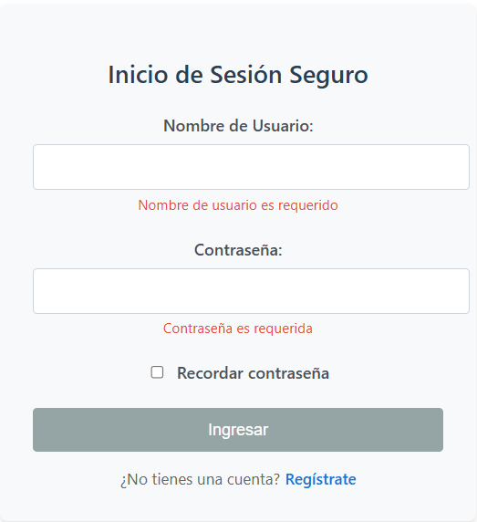
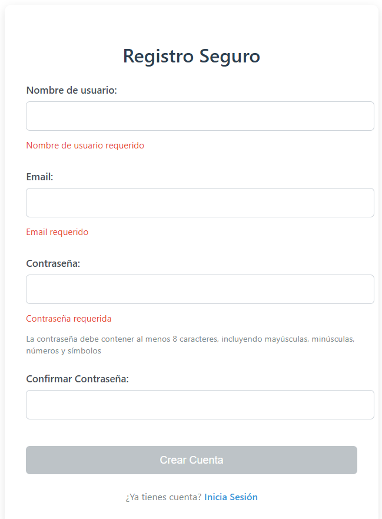

# Frontend

Este proyecto fue generado usando [Angular CLI](https://github.com/angular/angular-cli) version 20.1.5.
El objetivo Construir un flujo mínimo de autenticación (registro → login → bienvenida) aplicando buenas prácticas de seguridad en el código tanto del lado del cliente  como del servidor.

## Development server

Para ejecutar el proyecto, es necesario tener levantado el servicio en el backend, para lo cual se beberá acceder al siguiente url:

https://github.com/slobaton/api-auth-sqlite

Ubicarse en el directorio donde se encuentra index.js y ejecutar el comando:
```bash
npm install
```

Ejecutar los siguientes comandos para habilitar los end-points:
```bash
curl -s -X POST http://localhost:8080/register -H "Content-Type: application/json" -d '{"username":"amilcar","password":"Pass1234"}'
```
```bash
curl -s -X POST http://localhost:8080/login -H "Content-Type: application/json" -d '{"username":"amilcar","password":"Pass1234"}'
```
```bash
curl -s -H "Authorization: Bearer TOKEN" http://localhost:8080/me
```
```bash
curl -s -X POST http://localhost:8080/logout -H "Authorization: Bearer TOKEN"
```
Levantar el servicio con el comando:
```bash
npm start
```
Asimismo, dentro del directorio raiz, se deberá ejecutar el comando:

```bash
ng serve
```

Una vez que el servidor está en ejecución, abre el browser y accede a la url `http://localhost:4200/`. La aplicación se cargará automáticamente en caso de modificar alguno de los archivos del código fuente.

| Inicio de Sesión             | Registro de Usuarios              | Bienvenida              |
|--------------------------------|--------------------------------|---------------------------------|
|  |  |  |

## Estructura del código Angular CLI

Angular CLI incluye potentes herramientas de creación de código. Para generar un nuevo componente, ejecuta:

```bash
ng generate component component-name
```

Para obtener una lista completa de los esquemas disponibles (como `componentes`, `directivas` o `tuberías`), ejecutA:

```bash
ng generate --help
```

## Compilado y empaquetado de un proyecto

Para compilar y empaquetar un proyecto Angular, usar el comando:

```bash
ng build
```

Esto compilará y almacenará el proyecto en el 
Esto compilará tu proyecto y almacenará los artefactos de construcción en el directorio `dist/`. Por defecto, la versión de producción optimiza tu aplicación con fines de rendimiento y velocidad.

## Additional Resources

Para tener más información sobre el uso de Angular CLI, incluyendo referencias detalladas sobre los comandos, visita la página [Angular CLI Overview and Command Reference] (https://angular.dev/tools/cli).
